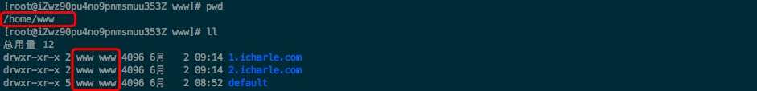

# 基于Linux EPOLL多路复用的C++轻量级WebServer
## 功能
* 可作为静态webserver(常规的html、图片、视频等)
* 支持GET、POST(交由cgi处理)请求
* 多站点支持
* 支持fastcgi(目前已支持php-fpm)
* 支持反向代理
* 支持session、cookie

**todo：**
* 负载均衡(开发中，完善支持随机模式、hash模式、权重模式三种负载均衡策略)
* 日志完善
* 实现类似nginx中rewrite模块

>[项目地址](https://github.com/icharle/WebServer) 欢迎PR、Issue、Star。

## 技术实现
* 使用EPOLL边缘触发(ET)的IO多路复用技术，非阻塞IO+ET方式
* 多线程(one loop per thread思想)充分利用CPU资源
* 采用基于事件驱动的Reactor模式，主Reactor负责accept，子Reactor负责处理I/O，通过事件循环
* FastCGI协议实现支持，可处理动态脚本语言
* cJSON方式读入配置文件
* 反向代理中域名自动解析IP地址
* 状态机化HTTP处理过程

## 演示
* [作为静态webserver](http://47.115.26.47/)
   
  >编译好的一个vue项目做为测试

* [大文件测试](http://47.115.26.47/xingkong.jpg)

  >一个7m+大小的图片做为测试

* 多host支持

  >由于服务器国内没有备案，使用curl模拟http请求在头部添加host测试
  
  ```
  curl -H "Host: 1.icharle.com" http://47.115.26.47/    # 预期输出结果为：这里是1.icharle.com站点
  curl -H "Host: 2.icharle.com" http://47.115.26.47/    # 预期输出结果为：这里是2.icharle.com站点
  ```

* [反向代理](http://47.115.26.47:8085/)
  
  >采用新启动一个8085端口webserver**反向代理80端口**，配置文件示例如下
  
  ```
  {
        "server": {
            "PORT": 8085,
            "ThreadNum": 4,
            "BackLog": 1024
        },
        "host": [{
            "default": {
                "root": "/home/www/default/",
                "access_log": "/www/log/default.log",
                "warn_log": "/www/log/default.warn.log",
                "proxy_pass": "http://127.0.0.1:80" # 反向代理80端口
            }
        }]
  }
  ```
  
* [CGI支持连接php-fpm](http://47.115.26.47/liuyanban/index.php)
  
  >简易的支持CURD的PHP项目做为测试(涉及GET、POST、AJAX、cookie、数据库交互)

## 食用
**要求：**
* Linux系统并已安装gcc/g++编译器
* GCC >= 4.9

```
git clone https://github.com/icharle/WebServer.git
cd WebServer
make

# 修改配置文件(见配置文件说明)

# fastcgi使用(目前支持php-fpm)
编译安装PHP
修改php-fpm.conf中listen改用监听9000端口(如下为php-fpm.conf文件)

[global]
pid = xxxxx
error_log = xxxxx
log_level = notice

[www]
listen = 127.0.0.1:9000 # 需要修改的地方
listen.backlog = 8192 
listen.allowed_clients = 127.0.0.1
listen.owner = www  # php-fpm运行的用户
listen.group = www  # php-fpm运行的用户组
listen.mode = 0666
user = www
group = www
pm = dynamic
pm.status_path = /phpfpm_70_status
pm.max_children = 80
pm.start_servers = 5
pm.min_spare_servers = 5
pm.max_spare_servers = 20
request_terminate_timeout = 100
request_slowlog_timeout = 30
slowlog = var/log/slow.log

# 运行启动
nohup ./bin/webserver >> web.log 2>&1 &
```

**注意：**
由于php-fpm默认运行在www用户及www用户组中，将root目录改为www用户，否则运行php脚本文件出现**权限错误**的问题。

```
# 创建不可登录的组帐户www
groupadd www
useradd www -s /sbin/nologin -g www  

# 修改root文件目录为www用户及组
chown -R www:www /home/www/(修改为自己root目录)

# 下图作者root文件目录示例
```


## 配置文件说明
```
{
  "server": {
    "PORT": 80,         // 运行端口
    "ThreadNum": 4,     // 启动线程数
    "BackLog": 1024     // listen最大值
  },
  "host": [
    {
      "default": {                                      // 默认站点(当host不匹配时候默认走default站点)
        "root": "/home/www/default/",                   // 该站点存放目录处
        "access_log": "/www/log/default.log",           // 暂时无日志输出
        "warn_log": "/www/log/default.warn.log",        // 暂时无日志输出
        "proxy_pass": "http://dududu.soarteam.cn"       // 反向代理配置(仅支持HTTP代理) 不写端口时候默认反代80端口
      },
      "1.icharle.com": {                                // host(即域名)
        "root": "/home/www/1.icharle.com/",
        "access_log": "/www/log/1.icharle.com.log",
        "warn_log": "/www/log/1.icharle.com.warn.log",
        "proxy_pass": "http://127.0.0.1:8043"           // 反向代理(IP+端口、域名+端口)
      },
      "2.icharle.com": {
        "root": "/home/www/2.icharle.com/",
        "access_log": "/www/log/2.icharle.com.log",
        "warn_log": "/www/log/2.icharle.com.warn.log"
      }
    }
  ]
}
```
